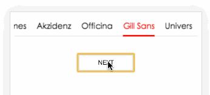

##  zSegmentControl

Make One Scrollable Tab As SegmentControl in Native Application With Javascript

#### How:

    //make init options
    var options = {
        element: document.getElementById('zSegmentControl'), //root container
        speed: 10, //biger for lower
        list: [ //init sth.
            'Helvetica',
            'Garamond',
            'Frutiger',
            'Bodoni',
            'Futura',
            'Times',
            'Akzidenz',
            'Officina',
            'Gill Sans',
            'Univers'
        ],
        initedCallback : function(instance){
            console.log('inited');
        },
        beforeCallback : function(instance){
            var index = instance.index;
            console.log(index);
        },
        afterCallback : function(instance){}
    }

    var sc = new SegmentControl(options);

    sc.tabTo(6);

    document.getElementById('button').addEventListener('click', function() {
        var nextIndex = sc.index + 1;
        if(sc.list[nextIndex]){
            sc.tabTo(nextIndex);
        }
    });

Author: yuchav@foxmail.com

